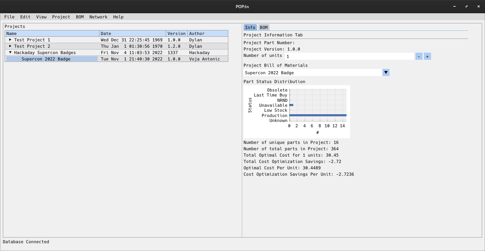
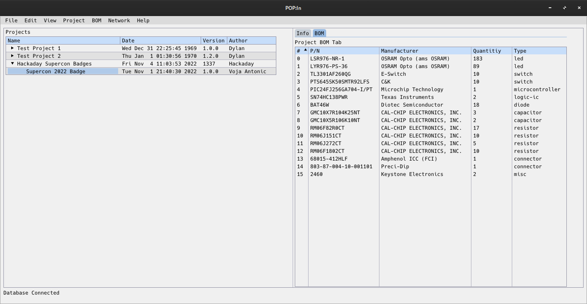
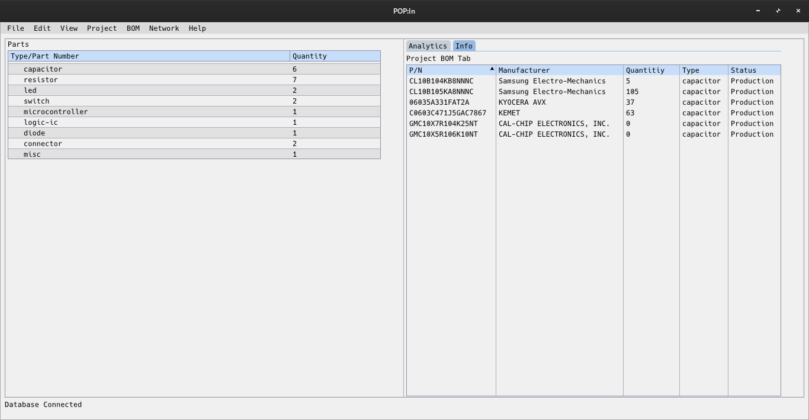

# Pop:In
Inventory Management, Project Manufacturing, and Smart Storage

Screenshots:

## What is Pop:In?
Pop:In is an inventory management software that will keep track of your projects, bill of materials, and parts in a convienent way. There are a number of inventory management solutions in existence, but none have gone as far as this project will.
The cornerstone of this project is the integration between a smart storage device and the database; this allows for automatic inventory keeping*, information about useage and when to order parts, and also just knowing where the hell you put that damn reel of parts.
Though this is not just for electronics, any kind of part can be used as the part fields are infinitely expandable. A lot of work has gone into the system to 

Given this is still very early in development (and I'm just trying to put some information here), the available features are quite minimal but you can enter projects, parts, bill of materials, and get some very basic analytical information about your projects.

More information will come soon

*working on achieving this in the near future; hardware has not been tested yet

## Components

### Client Software
This repository is specific to the client software to access the database and manage your inventory

### Daemon/Server Software
Some background processes to maintain and analyze data collected from the service. Everything can be done onsite, and no data will be sent outside of your domain.

### Hardware
The hardware is still very early in development, and will be disclosed at a later date.

## Build Instructions
Currently only Linux and Windows are supported, as the macOS build is problematic and the web cross compile with emscripten is... not going well. 

### Linux
If using an arch based distribution, run the following:

    sudo pacman -Syyu base-devel openssh git python orcania yder hiredis glfw-x11 openssl openssl-1.0 json-c ttf-hack

One key point to mention is the use of the Hack-Regular.ttf font. Right now it is not packaged with the system, but it is required for building. In the future, this will be integrated in the code.

Initialize the submodules:
    git submodule update --init

Then run the makefile:
    make all

### Windows (cross compile)
Native windows builds have not been tested, but the program will run if cross compiled with mingw from linux.

Again assuming an arch linux based distribution, install the following dependencies:
    sudo pacman -Syyu base-devel openssh git python mingw-w64-binutils mingw-w64-gcc orcania yder hiredis glfw-x11 openssl openssl-1.0 json-c ttf-hack

The next few dependencies are available from the AUR, which can be installed with yay:
    yay -Syu --needed mingw-w64-cmake mingw-w64-environment mingw-w64-glfw mingw-w64-pkg-config mingw-w64-openssl3 mingw-w64-json-c

A slight difference for the makefile, run the following command
    make OS=Windows all

To package all the libraries together to run on a windows machine, run the following
    make OS=Windows release

### macOS
From what it appears, a macOS build will compile but a window with nothing on it will show and that's it.

You can install libraries from homebrew to dynamically link them, but it would be far easier to statically compile them as is done in the makefile

As with linux, just run 
    make all

### Database Setup (Docker)
A docker-compose.yml file is provided in this repository to simplify the database setup.

Simply run
    docker-compose up -d

And your server should be listening in on localhost:6379

WARNING: PLEASE DO NOT RUN THIS WITH OPEN INTERNET ACCESS
There is no security enabled at the moment, and no login information to secure your data. This is a huge problem, and will be resolved in the coming weeks but has not been a focus in order to get out feature implementations.

If you want to monitor the database and get information about quieries and what items are stored there, navigate to http://localhost:8001
It will show you the redis insight browser interface, and allow you to debug interactions between the client and database.

#### Manual Database setup
If you're super impatient to setup the database, go to the related document [here](docs/Manual_Database_Setup.md)

### Clean build
`make clean` will only remove the .o and .d files in the `src` directory. Cleaning the system is required 
between builds for different cross compiles. `make clean-lib` will clean out all library build files.

It is imperative to run `make clean` before `make clean-lib`, as there are some issues with artifacts created if done in the reverse order.

## Roadmap

As excited as you may be to start playing with the software, there are a few key things that need to be accomplished before anyone can use it in a real capacity

### Items
#### Database Initilization
Right now if you were to run the software without hand initializing the database, it will crash. Not exactly ideal

#### Database Edits
While new parts, projects, and BOMs can be created with the client, they cannot be edited unless manually edited in the database.

### Checklist

- [ ] Database Initilization
- [ ] Part Editing
- [ ] Project Editing
- [ ] BOM Editing

## Known Bugs

### New Part Type Creation
I'm not 100% sure this bug has been fixed or not, but if you create a new part with a part type that is not currently in the database, the client software will crash. If you restart the client, the new part type will be available and you can proceed as normal. It is inconvienient, but at least doesn't destroy data.

## Keep up to date!

If you want to keep up to date, I'll be putting out posts on [slant.tech](http://slant.tech) and on the emailing list which you can sign up by clicking [here](http://listmonk.slant.tech/subscription/form)

## Get invovled!
I'll post more information about what development help can be done, but by far the biggest help for furthering this project along will be in the testing/feature request/documentation departments.

I have a list of features that will be rolling out as time goes on, but feel free to discuss new features in the Discussions tab instead of creating an issue ticket (I'll make a template for the issue tickets soon).

Any amount helps! Thank you!
